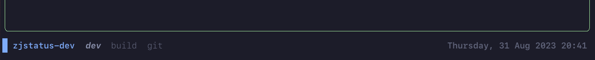
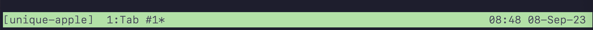
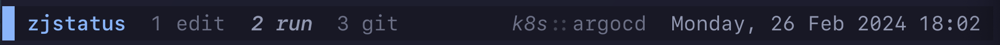
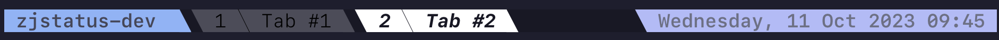
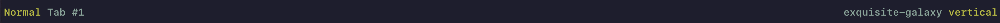
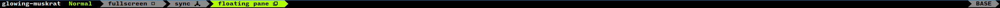
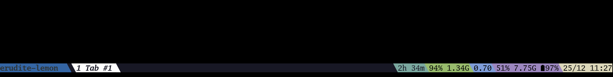
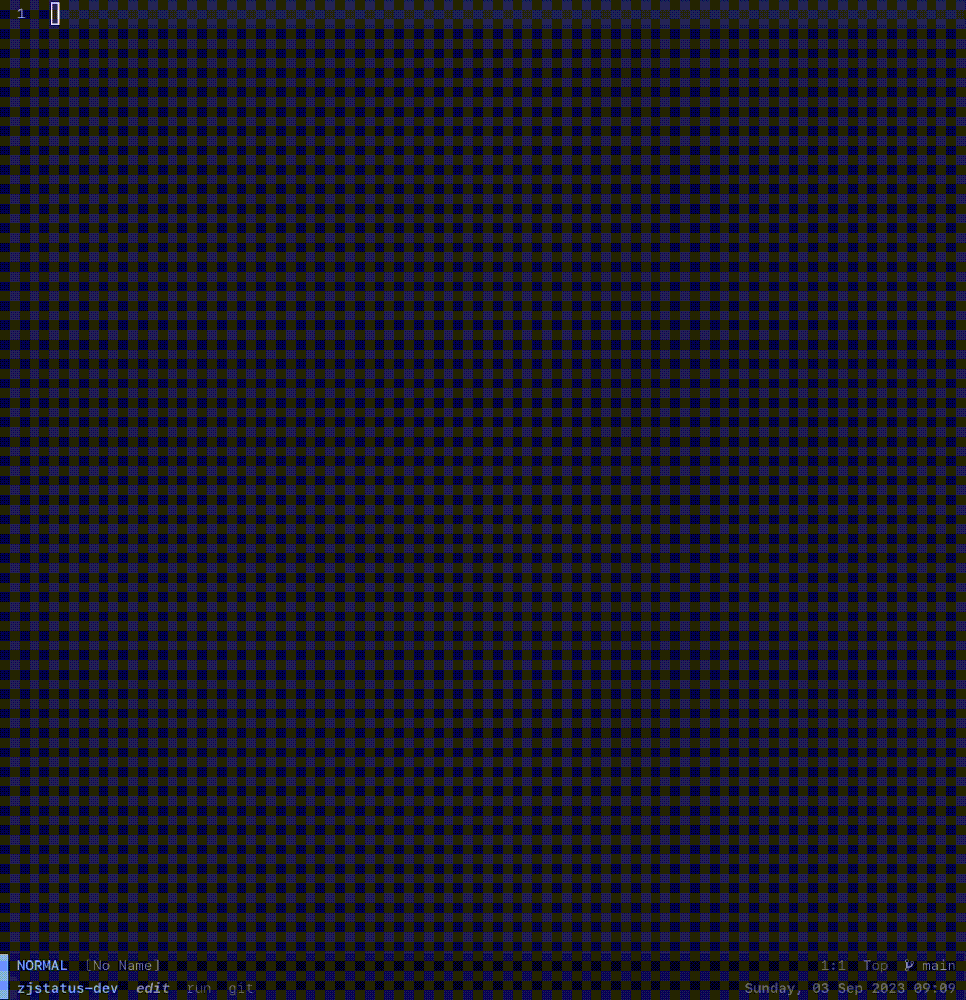

<h1 align="center">zjstatus & zjframes</h1>

<p align="center">
  A configurable and themable statusbar for zellij.
  <br><br>
  <a href="https://github.com/dj95/zjstatus/actions/workflows/lint.yml">
    
  </a>
  <a href="https://github.com/dj95/zjstatus/releases">
    
  </a>
  <a href="https://github.com/dj95/zjstatus/wiki">
    
  </a>

  <br><br>
  The goal of this statusbar is to provide a highly customizable and extensible statusbar for zellij. Single
  modules can be formatted separately. Due to the widget structure new modules can be created with ease.

  As an addition, this repsitory contains *zjframes* which can be used to toggle pane frames based on different
  conditions even without loading *zjstatus*, e.g. when using the default status bars.
</p>



### [👉 Check out and share your awesome configs in the community showcase!](https://github.com/dj95/zjstatus/discussions/44)

<details>
<summary><h3>Examples</h3></summary>
<b><a href="./examples/tmux.kdl">tmux style</a></b>

<br>
<b><a href="./examples/simple.kdl">simple style</a></b>

<br>
<b><a href="./examples/slanted.kdl">slanted style</a></b>

<br>
<b><a href="./examples/swap-layouts.kdl">example for swapping layouts with zjstatus</a></b>

<br>
<b><a href="./examples/compact.kdl">compact style (thanks to @segaja)</a></b>

<br>
<b><a href="./examples/conky.kdl">conky status (thanks to @benzwt)</a></b>
<a href="./examples/conky.conf">conky.conf</a>

<br>
<b>Demo GIF</b>

</details>

## 🚀 Installation

> [!TIP]
> For more detailed instructions, check out the [wiki](https://github.com/dj95/zjstatus/wiki/1-%E2%80%90-Installation)!

Download the latest binary in the github releases. Place it somewhere, zellij is able to access it. Then the
plugin can be included by referencing it in a layout file, e.g. the default layout one, or the config file.

In contrast to *zjstatus*, *zjframes* should only be used in the `load_plugins` option of the *config.kdl*
from zellij, as it should only be loaded in the background. For more details, please follow the [documentation](https://github.com/dj95/zjstatus/wiki/6---zjframes)

You could also refer to the plugin guide from zellij, after downloading the binary: [https://zellij.dev/documentation/plugin-loading](https://zellij.dev/documentation/plugin-loading)

Please ensure, that the configuration is correct.

> [!IMPORTANT]
> In case you experience any crashes or issues, please in the first step try to clear the cache! (`$HOME/.cache/zellij/` for Linux, `$HOME/Library/Caches/org.Zellij-Contributors.Zellij/` on macOS)

Sometimes, especially when updating plugins, it might come to caching issues, which can be resolved by clearing it. Please keep in
mind, that it will also clear the cache for running sessions and revokes granted permissions for plugins.

## ❄️ Installation with nix flake

Add this repository to your inputs and then with the following overlay to your packages.
Then you are able to install and refer to it with `pkgs.zjstatus`. When templating the
config file, you can use `${pkgs.zjstatus}/bin/zjstatus.wasm` as the path. `${pkgs.zjstatus}/bin/zjframes.wasm`
is also available in case you only want to use *zjframes*.

```nix
  inputs = {
    # ...

    zjstatus = {
      url = "github:dj95/zjstatus";
    };
  };


  # define the outputs of this flake - especially the home configurations
  outputs = { self, nixpkgs, zjstatus, ... }@inputs:
  let
    inherit (inputs.nixpkgs.lib) attrValues;

    overlays = with inputs; [
      # ...
      (final: prev: {
        zjstatus = zjstatus.packages.${prev.system}.default;
      })
    ];
```

## ⚙️ Configuration

For configuring, please follow the [documentation](https://github.com/dj95/zjstatus/wiki/3-%E2%80%90-Configuration).

## 🏎️ Quick Start for zjstatus

Place the following configuration in your default layout file, e.g. `~/.config/zellij/layouts/default.kdl`. Right after starting zellij, it will prompt for permissions, that needs to be granted in order for zjstatus to work. Simply navigate to the pane or click on it and press `y`. This must be repeated on updates. For more details on permissions, please visit the [wiki](https://github.com/dj95/zjstatus/wiki/2-%E2%80%90-Permissions).

> [!IMPORTANT]
> Downloading zjstatus as file and using `file:~/path/to/zjstatus.wasm` is recommend, even if the quickstart includes the https location.

> [!IMPORTANT]
> Using zjstatus involves creating new layouts and overriding the default one. This will lead to swap layouts not working, when they are not configured correctly. Please follow [this documentation](https://github.com/dj95/zjstatus/wiki/3-%E2%80%90-Configuration#swap-layouts) for getting swap layouts back to work, if you need them.

> [!IMPORTANT]
> If you want to hide borders, please remove the `hide_frame_for_single_pane` option or set it to `false`. Otherwise zjstatus will toggle frame borders even if the are hidden in zellijs config!

```javascript
layout {
    default_tab_template {
        children
        pane size=1 borderless=true {
            plugin location="https://github.com/dj95/zjstatus/releases/latest/download/zjstatus.wasm" {
                format_left   "{mode} #[fg=#89B4FA,bold]{session}"
                format_center "{tabs}"
                format_right  "{command_git_branch} {datetime}"
                format_space  ""

                border_enabled  "false"
                border_char     "─"
                border_format   "#[fg=#6C7086]{char}"
                border_position "top"

                hide_frame_for_single_pane "true"

                mode_normal  "#[bg=blue] "
                mode_tmux    "#[bg=#ffc387] "

                tab_normal   "#[fg=#6C7086] {name} "
                tab_active   "#[fg=#9399B2,bold,italic] {name} "

                command_git_branch_command     "git rev-parse --abbrev-ref HEAD"
                command_git_branch_format      "#[fg=blue] {stdout} "
                command_git_branch_interval    "10"
                command_git_branch_rendermode  "static"

                datetime        "#[fg=#6C7086,bold] {format} "
                datetime_format "%A, %d %b %Y %H:%M"
                datetime_timezone "Europe/Berlin"
            }
        }
    }
}
```

## 🏎️ Quickstart for zjframes

Add the following to the *config.kdl* or add the plugin to `load_plugins`, if you already load other plugins in the background.
Double check if the configuration matches your expectations. Then restart zellij.

> [!IMPORTANT]
> Downloading zjframes as file and using `file:~/path/to/zjframes.wasm` is recommend, even if the quickstart includes the https location.

```javascript
// Plugins to load in the background when a new session starts
load_plugins {
    "https://github.com/dj95/zjstatus/releases/latest/download/zjframes.wasm" {
        hide_frame_for_single_pane       "true"
        hide_frame_except_for_search     "true"
        hide_frame_except_for_scroll     "true"
        hide_frame_except_for_fullscreen "true"
    }
}
```

## 🧱 Widgets

The documentation for the widgets can be found in the [wiki](https://github.com/dj95/zjstatus/wiki/4-%E2%80%90-Widgets).

The following widgets are available:

- [command](https://github.com/dj95/zjstatus/wiki/4-%E2%80%90-Widgets#command)
- [datetime](https://github.com/dj95/zjstatus/wiki/4-%E2%80%90-Widgets#datetime)
- [mode](https://github.com/dj95/zjstatus/wiki/4-%E2%80%90-Widgets#mode)
- [notifications](https://github.com/dj95/zjstatus/wiki/4-%E2%80%90-Widgets#notifications)
- [pipe](https://github.com/dj95/zjstatus/wiki/4-%E2%80%90-Widgets#pipe)
- [session](https://github.com/dj95/zjstatus/wiki/4-%E2%80%90-Widgets#session)
- [swap layout](https://github.com/dj95/zjstatus/wiki/4-%E2%80%90-Widgets#swap-layout)
- [tabs](https://github.com/dj95/zjstatus/wiki/4-%E2%80%90-Widgets#tabs)

## 🚧 Development

Make sure you have rust and the `wasm32-wasi` target installed. If using nix, you could utilize the nix-shell
in this repo for obtaining `cargo` and `rustup`. Then you'll only need to add the target with
`rustup target add wasm32-wasi`.

With the toolchain, simply build `zjstatus` with `cargo build`. Then you are able to run the example configuration
with `zellij -l plugin-dev-workspace.kdl` from the root of the repository.

## 🤝 Contributing

If you are missing features or find some annoying bugs please feel free to submit an issue or a bugfix within a pull request :)

## 📝 License

© 2024 Daniel Jankowski

This project is licensed under the MIT license.

Permission is hereby granted, free of charge, to any person obtaining a copy
of this software and associated documentation files (the "Software"), to deal
in the Software without restriction, including without limitation the rights
to use, copy, modify, merge, publish, distribute, sublicense, and/or sell
copies of the Software, and to permit persons to whom the Software is
furnished to do so, subject to the following conditions:

The above copyright notice and this permission notice shall be included in all
copies or substantial portions of the Software.

THE SOFTWARE IS PROVIDED "AS IS", WITHOUT WARRANTY OF ANY KIND, EXPRESS OR
IMPLIED, INCLUDING BUT NOT LIMITED TO THE WARRANTIES OF MERCHANTABILITY,
FITNESS FOR A PARTICULAR PURPOSE AND NONINFRINGEMENT. IN NO EVENT SHALL THE
AUTHORS OR COPYRIGHT HOLDERS BE LIABLE FOR ANY CLAIM, DAMAGES OR OTHER
LIABILITY, WHETHER IN AN ACTION OF CONTRACT, TORT OR OTHERWISE, ARISING FROM,
OUT OF OR IN CONNECTION WITH THE SOFTWARE OR THE USE OR OTHER DEALINGS IN THE
SOFTWARE.
